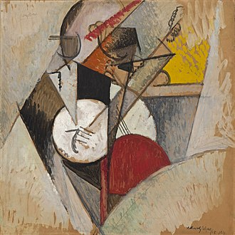

# Introduction

Jazz is a music genre that originated in the African-American communities of
New Orleans, United States, in the late 19th and early 20th centuries, and
developed from roots in blues and ragtime.

# Etymology and definition

The origin of the word jazz has resulted in considerable research, and its
history is well documented. It is believed to be related to jasm, a slang term
dating back to 1860 meaning "pep, energy".

The use of the word in a musical context was documented as early as 1915 in
the Chicago Daily Tribune. Its first documented use in a musical context in
New Orleans was in a November 14, 1916 Times-Picayune article about "jas
bands".

# References

* https://en.wikipedia.org/wiki/Jazz
