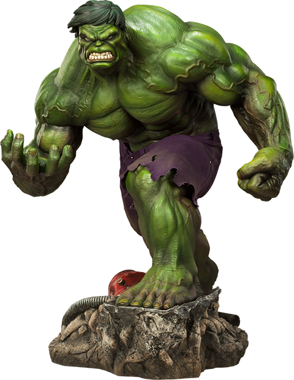

# Introduction

The Hulk is a fictional superhero appearing in publications by the American publisher Marvel Comics. Created by writer Stan Lee and artist Jack Kirby, the character first appeared in the debut issue of The Incredible Hulk (May 1962).

# History

The Hulk's original series was canceled with issue #6 (March 1963). Lee had written each story, with Kirby penciling the first five issues and Steve Ditko penciling and inking the sixth.

# Characterization

Like other long-lived characters, the Hulk's character and cultural interpretations have changed with time, adding or modifying character traits. The Hulk is typically seen as a hulking man with green skin, wearing only a pair of torn purple pants that survive his physical transformation. As the character progressed, other outfits were designed that could stretch to accommodate the transformations back and forth

# References

* https://en.wikipedia.org/wiki/Hulk_(comics)
